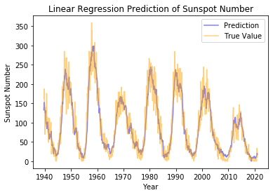

# Sunspot Prediction

## Goal
Predict monthly average number of sunspots for a given set of years

## Data
- From [Kaggle](https://www.kaggle.com/datasets/robervalt/sunspots), originally sourced from [Solar Influences Data Analysis Center at the Royal Observatory of Belgium](http://sidc.oma.be/).
- Contains the monthly average number of sunspots for years 1749-2021
- 3265 rows, 2 columns
- Columns: Date, Monthly Mean Total Sunspot Number

## Feature Engineering
For this project, we added four features to the dataset:
1. Month - month of observation
2. Year - year of observation
3. Lag - sunspot number for a given time interval before the current observation (1, 5, and 11 years)
4. Moving Average - average sunspot number for a given time interval before the current observation
(1, 5, and 11 years)

## Modeling
In this project, we initially hoped to compare linear regression, random forest, and gradient boosted trees against models specfic to time series data such as ARIMA using packages such as Spark-TS. However, due to package conflicts, we could not get the time series libraries to work. The attempted work on time series specific models can be found in `sunspots-time-series.ipynb`. The working code for the linear regression, random forest, and gradient boosted trees models can be found and explored in `sunspots.ipynb`.

## Evaluation
The data was split into a train, validation, and test set based on the year of observation. The years 1749-1881 were used for traning, 1882-1938 for validation, and 1939-2021 for testing. Each model was initialized with Pyspark's default parameters and evaluated using Root Mean Squared Error (RMSE) and R2 value. The models were compared to a baseline model which predicts the average sunspot value over the entire training set. This baseline had a RMSE of 76.51 and R2 of -0.03.

## Results
The linear regression model performed the best on the validation data with a RMSE of 23.46 and R2 of 0.82. The random forest (RMSE: 26.05, R2: 0.78) and GBT (RMSE: 26.37, R2: 0.77) performed slightly worse.

## Resources
https://www.kaggle.com/datasets/robervalt/sunspots
http://sidc.oma.be/
https://medium.com/analytics-vidhya/time-series-forecasting-using-spark-ml-part-2-31506514c643 
https://github.com/sryza/spark-timeseries 
https://www.twosigma.com/articles/introducing-flint-a-time-series-library-for-apache-spark/ 
